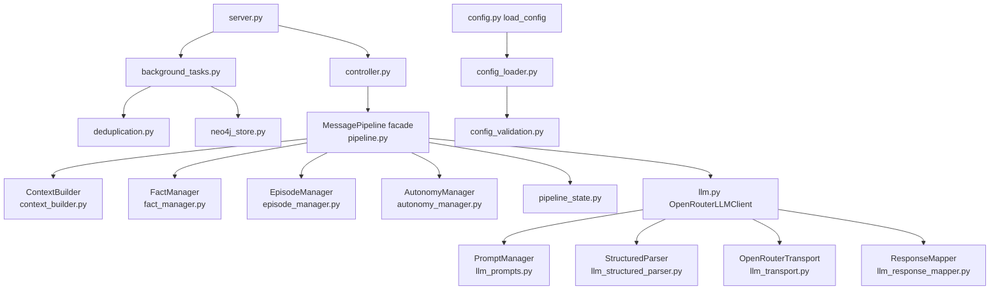

# GPT5 Roleplay System Refactoring Plan

## Scope
This plan refactors architecture only; runtime behavior and public entrypoints stay stable while code is decomposed.

Primary targets:
- `src/gpt5_roleplay_system/pipeline.py` (`MessagePipeline` God object)
- `src/gpt5_roleplay_system/llm.py` (`OpenRouterLLMClient` monolith)
- `src/gpt5_roleplay_system/server.py` (large background tasks with raw Cypher)
- `src/gpt5_roleplay_system/config.py` (`load_config` monolith)

Non-goals for this phase:
- No protocol changes (`session.py`/wire format unchanged)
- No behavior rewrites for memory/facts/autonomy logic
- No breaking public API changes

## 1) Module Structure Diagram

### Target File Layout
```text
src/gpt5_roleplay_system/
  pipeline.py                       # facade/orchestrator (kept for compatibility)
  context_builder.py                # new: context + participant + environment assembly
  fact_manager.py                   # new: fact queueing/extraction/storage lifecycle
  episode_manager.py                # new: episode finalization + experience writeback
  autonomy_manager.py               # new: mood/status/activity/delay state machine
  pipeline_state.py                 # new: shared state dataclasses for pipeline components

  llm.py                            # facade (kept), delegates to components
  llm_prompts.py                    # new: PromptManager (templates + payload formatting)
  llm_structured_parser.py          # new: StructuredParser (parse + cleanup + fallback)
  llm_transport.py                  # new: OpenRouterTransport (API calls + extra_body)
  llm_response_mapper.py            # new: structured -> domain mapping helpers

  server.py                         # bootstrap + session wiring (thin)
  background_tasks.py               # new: task loops orchestration
  deduplication.py                  # new: dedupe planners/parsers/shared helpers

  neo4j_store.py                    # extend with dedupe-specific query methods

  config.py                         # thin wrapper: load_config()
  config_loader.py                  # new: ConfigLoader + section loaders
  config_validation.py              # new: optional pydantic raw-config schema
```

### Dependency Graph (Target)


### Layering Rules
- `server.py` may depend on `background_tasks.py`, never on raw dedupe Cypher.
- `pipeline.py` may orchestrate components, but domain logic must move to component modules.
- `llm.py` may expose compatibility methods, but prompt/parsing/transport logic must live in dedicated modules.
- `neo4j_store.py` is the only module allowed to contain Cypher queries.
- `config.py` is API surface only (`load_config`), no section parsing logic.

## 2) Class Interfaces

## Pipeline Decomposition

### `PipelineRuntimeState` (new, `pipeline_state.py`)
```python
@dataclass
class PipelineRuntimeState:
    persona: str
    user_id: str
    llm_chat_enabled: bool = True
    environment: EnvironmentSnapshot = field(default_factory=EnvironmentSnapshot)
    participant_hints: list[Participant] = field(default_factory=list)
    display_names_by_id: dict[str, str] = field(default_factory=dict)
```

### `ContextBuilder` (new, `context_builder.py`)
```python
class ContextBuilder:
    def __init__(
        self,
        state: PipelineRuntimeState,
        knowledge_store: KnowledgeStore,
        memory: ConversationMemory,
        experience_store: ExperienceStore,
        tracer: Tracer,
        experience_vector_index: ExperienceIndexProtocol | None = None,
        experience_top_k: int = 3,
        experience_score_min: float = 0.78,
        experience_score_delta: float = 0.03,
        near_duplicate_collapse_enabled: bool = True,
        near_duplicate_similarity: float = 0.9,
        routine_summary_enabled: bool = False,
        routine_summary_limit: int = 2,
        routine_summary_min_count: int = 2,
        max_environment_participants: int = 10,
        persona_profiles: dict[str, str] | None = None,
    ) -> None: ...

    def update_environment(self, data: dict[str, Any]) -> None: ...
    def build_chat(self, data: dict[str, Any]) -> InboundChat: ...
    def merge_participants(self, chats: list[InboundChat]) -> list[Participant]: ...
    def participants_from_messages(
        self,
        messages: list[InboundChat],
        base_participants: list[Participant],
    ) -> list[Participant]: ...
    def participants_for_autonomy(self) -> list[Participant]: ...

    async def build_context(
        self,
        chat: InboundChat | None,
        participants: list[Participant],
        query_text: str | None = None,
        *,
        agent_state: dict[str, Any],
    ) -> ConversationContext: ...

    def build_facts_context(
        self,
        participants: list[Participant],
        evidence_messages: list[InboundChat],
        *,
        agent_state: dict[str, Any],
    ) -> ConversationContext: ...

    def collapse_batch(self, chats: list[InboundChat]) -> list[dict[str, Any]]: ...
    def participant_payload(self, participant: Participant) -> dict[str, Any]: ...
    def chat_payload(self, chat: Any) -> dict[str, Any]: ...
    def environment_payload(self, object_limit: int = 25) -> dict[str, Any]: ...

    def snapshot_state(self) -> dict[str, Any]: ...
    def restore_state(self, state: dict[str, Any]) -> None: ...
```

### `FactManager` (new, `fact_manager.py`)
```python
class FactManager:
    def __init__(
        self,
        state: PipelineRuntimeState,
        llm: LLMClient,
        knowledge_store: KnowledgeStore,
        tracer: Tracer,
        facts_config: FactsConfig,
        context_builder: ContextBuilder,
        autonomy_manager: "AutonomyManager",
    ) -> None: ...

    def snapshot_state(self) -> dict[str, Any]: ...
    def restore_state(self, state: dict[str, Any]) -> None: ...
    def recover_pending_from_memory(self, recent_items: list[MemoryItem]) -> None: ...

    def maybe_schedule_periodic_sweep(
        self,
        recent_chats: list[InboundChat],
        overflow_chats: list[InboundChat],
        participants: list[Participant],
    ) -> None: ...

    def schedule_store_facts(
        self,
        facts: list[ExtractedFact],
        participants: list[Participant],
    ) -> None: ...

    def store_facts(
        self,
        facts: list[ExtractedFact],
        participants: list[Participant],
    ) -> dict[str, int]: ...

    async def wait_for_idle(self) -> None: ...
```

### `EpisodeManager` (new, `episode_manager.py`)
```python
class EpisodeManager:
    def __init__(
        self,
        state: PipelineRuntimeState,
        llm: LLMClient,
        rolling_buffer: RollingBuffer,
        experience_store: ExperienceStore,
        tracer: Tracer,
        episode_config: EpisodeConfig,
        experience_vector_index: ExperienceIndexProtocol | None = None,
        compressor: MemoryCompressor | None = None,
    ) -> None: ...

    def snapshot_state(self) -> dict[str, Any]: ...
    def restore_state(self, state: dict[str, Any]) -> None: ...

    def schedule_check(
        self,
        *,
        last_inbound_ts: float,
        last_response_ts: float,
        persona: str,
    ) -> None: ...

    async def maybe_finalize(
        self,
        *,
        last_inbound_ts: float,
        last_response_ts: float,
        persona: str,
    ) -> bool: ...

    async def wait_for_idle(self) -> None: ...
```

### `AutonomyManager` (new, `autonomy_manager.py`)
```python
class AutonomyManager:
    def __init__(self, state: PipelineRuntimeState) -> None: ...

    def snapshot_state(self) -> dict[str, Any]: ...
    def restore_state(self, state: dict[str, Any]) -> None: ...

    def mark_inbound_activity(self, now_ts: float | None = None) -> None: ...
    def mark_response_activity(self, now_ts: float | None = None) -> None: ...

    def update_from_bundle(self, bundle: LLMResponseBundle, *, source: str) -> None: ...
    def apply_scheduler_override(
        self,
        decision_value: Any,
        delay_value: Any,
    ) -> tuple[str | None, float | None]: ...

    def filter_autonomous_actions(
        self,
        actions: list[Action],
        participants: list[Participant],
    ) -> list[Action]: ...

    def chat_texts_from_actions(self, actions: list[Action]) -> list[str]: ...

    def seconds_since_activity(self, now: float | None = None) -> float: ...
    def activity_snapshot(
        self,
        recent_activity_window_seconds: float,
        *,
        recent_messages_count: int,
    ) -> dict[str, Any]: ...

    def agent_state(self, now_ts: float | None = None) -> dict[str, Any]: ...
    def consume_delay_hint_seconds(self) -> float | None: ...
```

### `MessagePipeline` (existing facade in `pipeline.py`, slimmed)
Public API remains unchanged:
```python
class MessagePipeline:
    def snapshot_state(self) -> dict[str, Any]: ...
    def restore_state(self, state: dict[str, Any]) -> None: ...
    def update_environment(self, data: dict[str, Any]) -> None: ...

    def set_persona(self, persona: str) -> None: ...
    def set_user_id(self, user_id: str) -> None: ...
    def set_llm_chat_enabled(self, enabled: bool) -> None: ...
    def llm_chat_enabled(self) -> bool: ...

    async def process_chat(self, data: dict[str, Any]) -> list[Any]: ...
    async def process_chat_batch(self, batch: list[dict[str, Any]]) -> list[Any]: ...

    async def generate_autonomous_actions(
        self,
        recent_activity_window_seconds: float,
    ) -> list[Any]: ...

    def activity_snapshot(self, recent_activity_window_seconds: float) -> dict[str, Any]: ...
    def consume_autonomy_delay_hint_seconds(self) -> float | None: ...
```

Compatibility shims to keep until test migration completes:
- Keep private proxies currently used in tests (`_filter_autonomous_actions`, `_memory`, `_rolling_buffer`, `_experience_store`).

## LLM Decomposition

### `PromptManager` (new, `llm_prompts.py`)
```python
class PromptManager:
    def system_prompt_for_context(self, context: ConversationContext) -> str: ...
    def state_system_prompt_for_context(self, context: ConversationContext) -> str: ...
    def autonomous_system_prompt_for_context(self, context: ConversationContext) -> str: ...
    def facts_system_prompt(self) -> str: ...

    def format_address_check(
        self,
        chat: InboundChat,
        persona: str,
        environment: EnvironmentSnapshot | None,
        participants: list[Participant] | None,
        context: ConversationContext | None,
    ) -> str: ...

    def format_context(
        self,
        chat: InboundChat,
        context: ConversationContext,
        overflow: list[InboundChat] | None,
        incoming_batch: list[dict[str, Any]] | None,
    ) -> str: ...

    def format_facts_context_from_messages(
        self,
        evidence_messages: list[InboundChat],
        participants: list[Participant],
        persona: str,
        user_id: str,
        summary: str,
        summary_meta: dict[str, Any],
        related_experiences: list[dict[str, Any]],
        people_facts: dict[str, Any],
    ) -> str: ...

    def format_autonomous_context(
        self,
        context: ConversationContext,
        activity: dict[str, Any],
    ) -> str: ...
```

### `StructuredParser` (new, `llm_structured_parser.py`)
```python
class StructuredParser:
    def request_structured(
        self,
        client: Any,
        model_class: Any,
        kwargs: dict[str, Any],
        *,
        request_type: str,
        trace_label: str = "",
    ) -> Any | None: ...

    def clean_json(self, text: str) -> str: ...
```

Parser requirements:
- Preserve current fallback behavior: `parse()` -> raw `create()` -> cleanup -> model validation.
- Preserve parse-failure cache for "No endpoints found" keys.

### `OpenRouterTransport` (new, `llm_transport.py`)
```python
class OpenRouterTransport:
    def __init__(
        self,
        client: Any,
        reasoning: str,
        provider_order: list[str] | None,
        provider_allow_fallbacks: bool | None,
        facts_provider_order: list[str] | None,
        facts_provider_allow_fallbacks: bool | None,
    ) -> None: ...

    def request_text(
        self,
        *,
        model: str,
        system_prompt: str,
        user_prompt: str,
        max_tokens: int,
        temperature: float,
        include_reasoning: bool | None,
        include_provider: bool,
        provider_for_facts: bool = False,
        trace_label: str = "",
    ) -> str: ...

    def apply_extra_body(
        self,
        kwargs: dict[str, Any],
        *,
        include_reasoning: bool,
        include_provider: bool,
        provider_for_facts: bool = False,
    ) -> None: ...
```

### `ResponseMapper` (new, `llm_response_mapper.py`)
```python
class ResponseMapper:
    def bundle_from_structured(self, parsed: Any, mode: str = "chat") -> LLMResponseBundle: ...
    def state_update_from_structured(self, parsed: Any) -> LLMStateUpdate: ...
    def facts_from_structured(self, parsed: Any) -> list[ExtractedFact]: ...
```

### `OpenRouterLLMClient` (existing facade in `llm.py`, slimmed)
Public API remains unchanged.
Compatibility methods kept as delegating wrappers until tests migrate:
- `_system_prompt_for_context`
- `_format_context`
- `_format_autonomous_context`
- `_format_facts_context_from_messages`
- `_format_address_check`
- `_request_structured` (including old override compatibility)
- `_request_bundle`, `_request_state_update`, `_request_autonomous_bundle`, `_request_facts_from_messages`
- `_request_text_with_model`

## Server and Deduplication Decomposition

### `FactsDeduplicationService` (new, `background_tasks.py`)
```python
class FactsDeduplicationService:
    def __init__(
        self,
        config: ServerConfig,
        knowledge_store: Neo4jKnowledgeStore,
        llm_client: OpenRouterLLMClient,
    ) -> None: ...

    async def run_forever(self) -> None: ...
    async def run_once(self) -> dict[str, Any]: ...
```

### `ExperienceDeduplicationService` (new, `background_tasks.py`)
```python
class ExperienceDeduplicationService:
    def __init__(
        self,
        config: ServerConfig,
        knowledge_store: Neo4jKnowledgeStore,
    ) -> None: ...

    async def run_forever(self) -> None: ...
    async def run_once(self) -> dict[str, Any]: ...
```

### `ExperienceDedupePlanner` (new, `deduplication.py`)
```python
class ExperienceDedupePlanner:
    @staticmethod
    def build_plans(
        rows: list[dict[str, Any]],
        similarity_threshold: float,
        max_gap_seconds: float,
    ) -> tuple[list[dict[str, Any]], int]: ...
```

### `Neo4jKnowledgeStore` extension points (existing class)
Add methods so server/background code no longer owns Cypher:
```python
class Neo4jKnowledgeStore(KnowledgeStore):
    def init_runtime_marker(self, runtime_key: str, initialized_ts: float) -> None: ...
    def mark_runtime_running(self, runtime_key: str, started_ts: float) -> None: ...
    def mark_runtime_success(self, runtime_key: str, payload: dict[str, Any]) -> None: ...
    def mark_runtime_error(self, runtime_key: str, payload: dict[str, Any]) -> None: ...

    def fetch_facts_dedupe_candidates(self) -> list[dict[str, Any]]: ...
    def apply_deduped_facts(
        self,
        user_id: str,
        refined_facts: list[str],
        *,
        deduped_ts: float,
    ) -> None: ...
    def mark_facts_deduped(self, user_id: str, *, deduped_ts: float) -> None: ...

    def fetch_experience_dedupe_candidates(
        self,
        *,
        index_name: str,
        neighbor_k: int,
        score_floor: float,
    ) -> list[dict[str, Any]]: ...
    def merge_experience_group(
        self,
        *,
        keep_id: str,
        dup_ids: list[str],
        merged_timestamp: float,
        merged_timestamp_start: str,
        merged_timestamp_end: str,
        deduped_ts: float,
    ) -> int: ...
```

## Config Decomposition

### `ConfigLoader` (new, `config_loader.py`)
```python
class ConfigLoader:
    def __init__(self, env: Mapping[str, str] | None = None) -> None: ...
    def load(self, path: str | None = None) -> ServerConfig: ...

    def load_llm_config(self, raw: dict[str, Any], api_keys: dict[str, Any]) -> LLMConfig: ...
    def load_memory_config(self, raw: dict[str, Any], llm_config: LLMConfig) -> MemoryConfig: ...
    def load_knowledge_config(self, raw: dict[str, Any]) -> KnowledgeConfig: ...
    def load_facts_config(self, raw: dict[str, Any]) -> FactsConfig: ...
    def load_episode_config(self, raw: dict[str, Any]) -> EpisodeConfig: ...
    def load_autonomy_config(self, raw: dict[str, Any]) -> AutonomyConfig: ...
    def load_neo4j_config(self, raw: dict[str, Any]) -> Neo4jConfig: ...
```

### `config.py` (existing)
- Keep exported dataclasses and `load_config(path: Optional[str]) -> ServerConfig`.
- `load_config` becomes a thin wrapper around `ConfigLoader().load(path)`.

### Optional validation layer (`config_validation.py`)
- `RawServerConfigModel` + nested pydantic models for YAML shape validation.
- Validation warnings should not break startup unless critical (syntax/type/required sections).

## 3) Migration Strategy (Stability-First)

## Phase 0: Baseline and Contracts
1. Freeze behavior with current tests as gate (`pytest`).
2. Add contract tests for fragile compatibility surfaces now:
- Pipeline private compatibility (`_filter_autonomous_actions`, internal attrs used by tests).
- LLM compatibility wrappers (`_request_structured` override behavior).
- Server function exports (`_compute_autonomy_delay`, `_build_experience_dedupe_plans`).

Exit criteria:
- Current test suite passes unchanged.

## Phase 1: Pipeline Split
1. Add `pipeline_state.py` and `AutonomyManager`; move mood/status/activity logic first.
2. Add `EpisodeManager`; move episode scheduling/finalization and keep `MessagePipeline._schedule_episode_check` as pass-through.
3. Add `ContextBuilder`; move context/participant/environment logic.
4. Add `FactManager`; move fact queue, worker, extraction, store logic.
5. Convert `MessagePipeline` into coordinator that composes these classes.
6. Keep compatibility proxies for methods/fields referenced by tests.

Exit criteria:
- `tests/test_pipeline.py`, `tests/test_controller.py`, `tests/test_session_batching.py` remain green.

## Phase 2: LLM Split
1. Add `llm_prompts.py`, move prompt templates and payload formatters.
2. Add `llm_structured_parser.py`, move robust parse logic and no-endpoint cache handling.
3. Add `llm_transport.py`, move API request execution and `extra_body` routing/reasoning logic.
4. Add `llm_response_mapper.py`, move structured-object mapping helpers.
5. Refactor `OpenRouterLLMClient` to orchestration-only while preserving existing method names as wrappers.
6. Preserve old `_request_structured` override compatibility path (`TypeError` trace-label fallback) for tests/subclasses.

Exit criteria:
- `tests/test_llm.py` and `tests/test_llm_facts_prompting.py` pass without test rewrites.

## Phase 3: Server + Store Boundary Cleanup
1. Add `deduplication.py` for reusable helpers (`parse_deduped_facts_response`, plan builder, window helpers).
2. Add `background_tasks.py` services for facts/experience dedupe loops.
3. Move raw Cypher from `server.py` to new `Neo4jKnowledgeStore` methods.
4. Update `GPT5RoleplayServer.start()` to start/stop service tasks instead of calling large loop functions directly.
5. Keep thin wrapper functions in `server.py` with old names for compatibility and tests (delegating to new modules).

Exit criteria:
- `tests/test_autonomy.py` and `tests/test_server_experience_index.py` pass.
- `server.py` contains no raw Cypher strings.

## Phase 4: Config Loader Refactor
1. Create `config_loader.py` with section-specific loaders.
2. Move parsing/preference logic (YAML/env/default precedence) into dedicated section methods.
3. Keep `config.py` dataclasses; make `load_config` call `ConfigLoader.load`.
4. Add optional pydantic raw-config validation (`config_validation.py`) without changing runtime return type (`ServerConfig`).

Exit criteria:
- `tests/test_config.py` passes unchanged.
- `load_config` behavior and return schema unchanged.

## Phase 5: Cleanup and Hardening
1. Remove dead internal duplicates in facades after tests switch to component-level tests.
2. Keep deprecation notes for legacy private wrappers for one release cycle.
3. Final pass on imports to ensure no circular dependencies.

Exit criteria:
- Full test suite green.
- File-size reductions achieved (pipeline/llm/server/config each reduced significantly).

## File-by-File Tactical Plan

### `pipeline.py`
- Keep constructor args and public methods unchanged.
- Internally instantiate: `PipelineRuntimeState`, `ContextBuilder`, `AutonomyManager`, `FactManager`, `EpisodeManager`.
- Replace direct private logic blocks with delegating calls.
- Merge snapshot/restore from sub-managers into existing state shape:
  - keep keys: `rolling_buffer`, `memory`, `facts`, `episode`, `status`.

### `llm.py`
- Keep class exports and dataclasses (`LLMClient`, `ExtractedFact`, `LLMResponseBundle`, etc.) unchanged.
- Move prompt strings/formatters and parser transport details out.
- Keep existing helper functions exported where tests import them (or re-export wrappers).

### `server.py`
- Keep entrypoints: `run_server`, `main`, `GPT5RoleplayServer`.
- Move dedupe loops and helper logic to new modules.
- Keep old helper function names as delegating wrappers for current tests.

### `config.py`
- Keep all dataclass definitions and `load_config` function signature.
- Replace monolithic body with calls to loader sections.

## 4) Dependency Analysis

## Shared Runtime Dependencies

### Pipeline shared objects
- `ConversationMemory`, `RollingBuffer`, `ExperienceStore`: shared mutable state; owned by `SessionController`.
- `KnowledgeStore`: read/write facts/people.
- `LLMClient`: generation + fact extraction.
- `Tracer`: event emission.
- `PipelineRuntimeState`: shared persona/user/environment/hints state.

Dependency direction:
- `MessagePipeline` -> managers
- Managers can depend on shared state/services, but not on `SessionController` or `server.py`.

### LLM shared objects
- OpenAI client instance
- prompt cache stats
- reasoning trace store

Dependency direction:
- `OpenRouterLLMClient` -> (`PromptManager`, `OpenRouterTransport`, `StructuredParser`, `ResponseMapper`)
- `PromptManager` must be pure (no network calls)
- `StructuredParser` should not know domain behavior beyond schema class + cleanup rules

### Server/dedupe dependencies
- Dedupe services depend on `Neo4jKnowledgeStore` methods, not raw driver usage in `server.py`.
- Planner helpers are pure functions/classes (`deduplication.py`), testable without DB.

### Config dependencies
- `ConfigLoader` handles raw inputs and precedence resolution.
- Existing dataclasses remain canonical runtime config model.
- Optional pydantic validation stays at input boundary only.

## Import Boundary Rules
- `context_builder.py` cannot import `fact_manager.py`/`episode_manager.py`.
- `fact_manager.py` may depend on `ContextBuilder` interface, not `MessagePipeline` internals.
- `background_tasks.py` cannot import `server.py` (avoid cycles).
- `config_loader.py` cannot import runtime modules unrelated to config types.

## 5) Testing Strategy

## Keep Existing Tests Passing During Migration
- Do not force immediate test rewrites.
- Maintain compatibility wrappers and module-level function names while moving internals.

## Existing test suites that must remain green
- `tests/test_pipeline.py`
- `tests/test_controller.py`
- `tests/test_session_batching.py`
- `tests/test_llm.py`
- `tests/test_llm_facts_prompting.py`
- `tests/test_autonomy.py`
- `tests/test_server_experience_index.py`
- `tests/test_config.py`

## New tests to add

### Pipeline component tests
- `tests/test_context_builder.py`
- `tests/test_fact_manager.py`
- `tests/test_episode_manager.py`
- `tests/test_autonomy_manager.py`

Coverage focus:
- snapshot/restore shape compatibility
- participant resolution parity
- fact worker flush triggers and queue trimming
- episode trigger reasons and overlap behavior
- autonomy decision/delay normalization

### LLM component tests
- `tests/test_llm_prompts.py`
- `tests/test_llm_structured_parser.py`
- `tests/test_llm_transport.py`
- `tests/test_llm_response_mapper.py`

Coverage focus:
- prompt payload determinism (stable sort/JSON)
- parse fallback robustness
- provider routing and reasoning `extra_body`
- structured output mapping parity

### Server/dedupe/store tests
- `tests/test_background_tasks.py`
- `tests/test_deduplication.py`
- extend `tests/test_server_experience_index.py`

Coverage focus:
- dedupe run stats and runtime metadata writes
- planner behavior across edge cases
- server task startup/shutdown lifecycle

### Config tests
- `tests/test_config_loader.py` (new)
- keep `tests/test_config.py` unchanged as compatibility tests

Coverage focus:
- env > yaml > defaults precedence
- bool/optional bool parsing
- provider/facts-provider override behavior

## Test execution sequence per PR
1. Unit tests for the newly extracted module.
2. Existing compatibility suite for the parent module.
3. Full `pytest` before merge.

## 6) Risk Assessment

| Risk | Impact | Likelihood | Mitigation |
|---|---|---|---|
| Behavior drift in `MessagePipeline` orchestration | High | Medium | Extract in small slices, keep facade behavior and state keys identical, run full pipeline tests each slice |
| Async race regressions (facts worker / episode task) | High | Medium | Preserve task scheduling semantics; add explicit `wait_for_idle` hooks for deterministic tests |
| Test breakage due private API coupling | High | High | Keep compatibility wrappers/attributes until dedicated tests migrate |
| Prompt formatting drift affecting model outputs/cache hit rate | Medium | Medium | Move prompt logic without semantic edits first; assert payload snapshots in tests |
| Structured parse fallback regressions | High | Medium | Keep current fallback order and "no endpoints found" cache behavior verbatim in parser component |
| Server cyclic dependencies after module split | Medium | Medium | Enforce dependency rules (`server.py` -> `background_tasks.py`, never reverse) |
| Dedupe query regressions after moving Cypher | High | Medium | Move query text as-is into store methods first; only then refactor internals |
| Config precedence changes | High | Medium | Keep old `load_config` tests unchanged; add explicit precedence tests before switching implementation |
| InMemory store compatibility with dedupe services | Medium | Low | Keep service guards (`isinstance(Neo4jKnowledgeStore)`) and no-op behavior for in-memory |

## Breaking-Change Prevention Checklist
- Keep import paths and public symbols stable (`pipeline.py`, `llm.py`, `server.py`, `config.py`).
- Keep `load_config` return type `ServerConfig` unchanged.
- Keep snapshot format keys unchanged (`facts`, `episode`, `status`).
- Keep server helper function names currently imported by tests.
- Keep old LLM compatibility methods until tests are migrated.

## Implementation Order Recommendation (for Code mode)
1. Pipeline split (`AutonomyManager` -> `EpisodeManager` -> `ContextBuilder` -> `FactManager`)
2. LLM split (`PromptManager` -> `StructuredParser` -> `Transport` -> client orchestration)
3. Server/dedupe/store boundary cleanup
4. Config loader refactor + optional pydantic validation
5. Compatibility cleanup (only after all tests and migration tests pass)

## Definition of Done
- All existing tests pass unchanged.
- New component-level tests exist for each extracted module.
- `pipeline.py`, `llm.py`, `server.py`, `config.py` reduced to orchestration/facade roles.
- Raw Cypher removed from `server.py` and centralized in `neo4j_store.py`.
- Refactoring is behavior-preserving from the perspective of protocol and public APIs.
